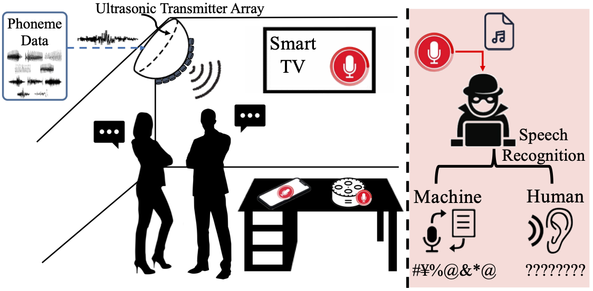

# InfoMasker: Preventing Eavesdropping Using Phoneme-Based Noise

This repo corresponds to the paper "InfoMasker: Preventing Eavesdropping Using Phoneme-Based Noise ". Here we provide the source codes and audio samples. There is also a [Demo Page](https://infomasker2023.github.io/) in progress.

